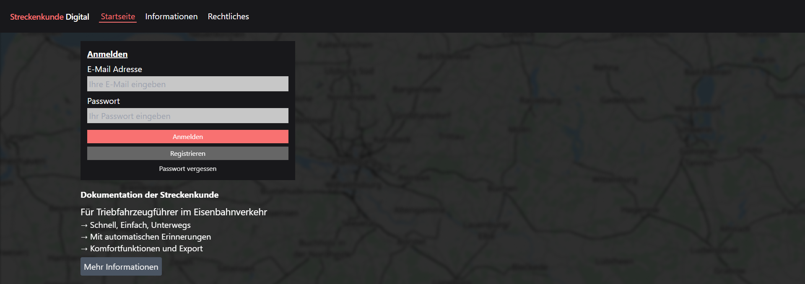
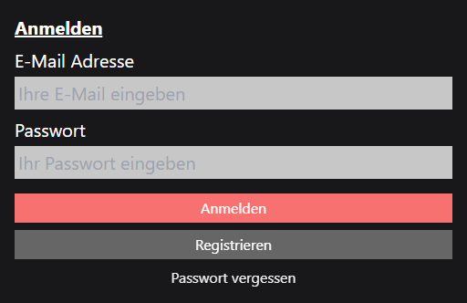
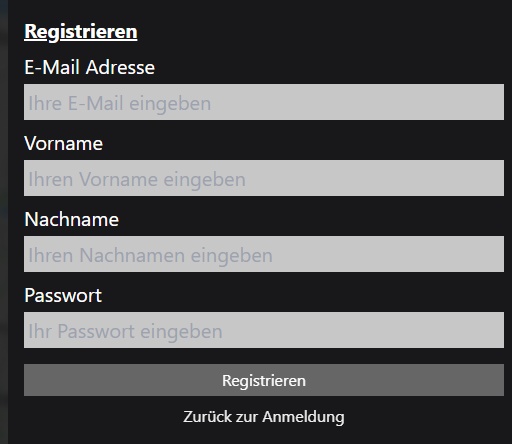
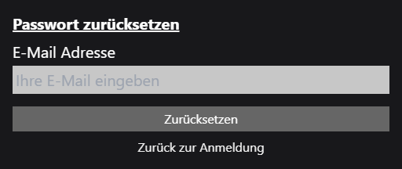

# Startseite

Jeder Nutzer ohne eine gültige Anmeldung wird auf der Willkommensseite begrüßt. Hier kann sich der Nutzer entweder anmelden oder ein neues Benutzerkonto registrieren. Außerdem gibt es die Möglichkeit, ein neues Passwort anzufordern, falls der Nutzer sein Passwort vergessen hat.

## Anmeldung mit vorhandenem Benutzerkonto

Jeder Nutzer kann sich auf der Plattform registrieren und anmelden. Dazu wird ein Benutzername und ein Passwort benötigt. Die Anmeldung erfolgt über die Webseite und ist für jeden Nutzer zugänglich. Der Benutzername ist die E-Mail-Adresse, die bei der Registrierung angegeben wurde. Das Passwort wird bei der Registrierung festgelegt und kann jederzeit durch die Passwort-Vergessen Funktion geändert werden.

## Registrierung eines neuen Benutzerkontos

Um ein neues Benutzerkonto zu registrieren, muss der Nutzer auf der Webseite die Registrierungsfunktion aufrufen. Dazu wird ein Benutzername (E-Mail), der vollständige Name des Anwenders und ein Passwort benötigt.

## Passwort vergessen

Wenn ein Nutzer sein Passwort vergessen hat, kann er über die Webseite ein neues Passwort anfordern. Dazu wird die E-Mail-Adresse benötigt, die bei der Registrierung angegeben wurde. Der Nutzer erhält dann eine E-Mail mit einem neuen Passwort zur vorrübergehenden Anmeldung.

