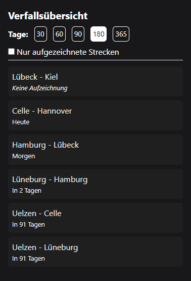

# Dashboard

Auf dem Dashboard sieht der Nutzer eine Übersicht zum Verfall seiner dokumentierten Streckenkunden, allgemeine Informationen zu seinem Benutzerkonto und eine kleine Statistik über die Anzahl der von ihm eingepflegten Strecken und Touren.

## Verfallsübersicht

In diesem Modul hat der Nutzer die Möglichkeit, sich einen Überblick über den Verfall seiner Streckenkunden zu verschaffen. Hier werden alle Streckenkunden aufgelistet, die in seinem festgelegten Zeitraum (Auswahl der Tage) ablaufen werden. Der Nutzer kann zudem die Strecken rausfiltern, die er noch nie dokumentiert hat. Dafür kann er die Checkbox "Nur aufgezeichnete Strecken" verwenden.

### Nur aufgezeichnete Strecken

Es werden nur die Strecken angezeigt, die bereits in der Vergangenheit dokumentiert wurden und in dem angebenen Zeitraum der Tage ablaufen werden und somit ein Verfallsdatum haben.
Abgelaufene Strecken werden immer angezeigt, unabhängig der Filter.

### Alle Strecken anzeigen

Alle Strecken werden angezeigt, unabhängig davon, ob sie bereits dokumentiert wurden oder nicht. In diesem Fall wird unter der Strecke "Keine Aufzeichnung" dargestellt und alle Strecken die unter dieses Kriterium fallen, werden ganz oben in der Liste dargestellt. Abgelaufene Strecken werden immer angezeigt, unabhängig der Filter.

