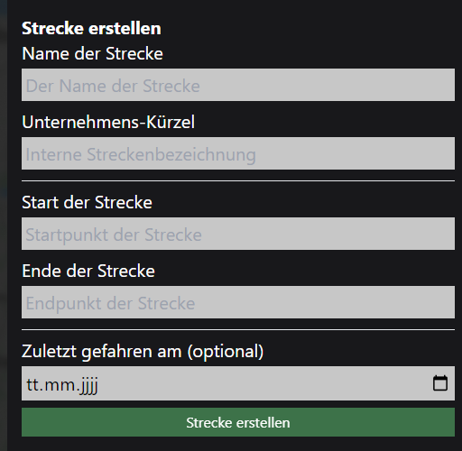
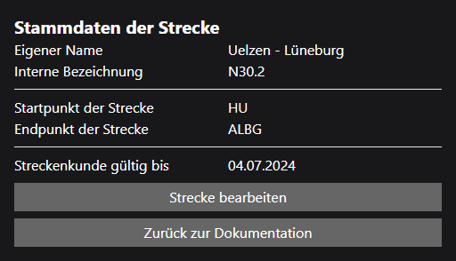
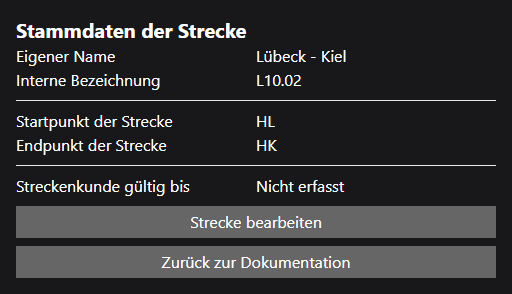
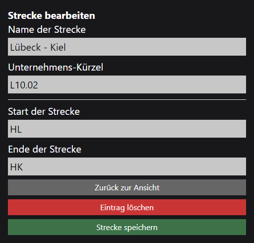

# Strecken

Eine Strecke ist ein Abschnitt im Schienennetz, der von einem Start- zu einem Endpunkt führt. Die Strecke besteht immer aus einem Namen, zwei Punkten (Start und Endpunkt) und optional einem Namen, der Unternehmensintern verwendet wird. Die Strecke kann auch in einer Tour inbegriffen sein, um die Dokumentation mehrerer Strecken zu vereinfachen.

## Erstellen

Um eine neue Strecke zu erstellen, klicke auf den Button "Strecke erstellen" auf der Seite [Dokumentation](../index.md). Es öffnet sich ein Dialog, in dem du die notwendigen Informationen eingeben kannst.

- **Name:** Der Name der Strecke.
- **Unternehmens-Kürzel:** (optional) Bezeichner für die Strecke.
- **Start der Strecke:** Der Startpunkt der Strecke.
- **Ende der Strecke:** Der Endpunkt der Strecke.
- **Zuletzt gefahren am:** (optional) Das Datum, an dem die Strecke zuletzt befahren wurde.
    - Standardmäßig wird kein Datum angegeben.
    - Mit Eintrag wird die Strecke zur Erstellung mit der Streckenkunde vermerkt.

## Ansehen

Um eine Strecke anzusehen, klicke auf den Namen der Strecke an einem beliebigen Punkt innerhalb der Anwendung. Es öffnet sich ein Dialog, in dem du die Informationen zur Strecke einsehen kannst. Die Strecke kann z.B. über die Suche der [Dokumentation](../index.md) gefunden werden. Es werden alle Daten, sowie die Gültigkeit der Streckenkunde angezeigt.

Hat die Strecke keine dokumentierte Streckenkunde, wird dies mit "Nicht erfasst" gekennzeichnet

## Bearbeiten

Um eine Strecke zu bearbeiten, klicke auf den Namen der Strecke an einem beliebigen Punkt innerhalb der Anwendung um die Strecke anzusehen. Anschließend klicke auf den Button "Strecke bearbeiten". Es öffnet sich ein Dialog, in dem du die notwendigen Informationen ändern oder die Strecke komplett löschen kannst. Die Strecke kann z.B. über die Suche der [Dokumentation](../index.md) gefunden werden.

