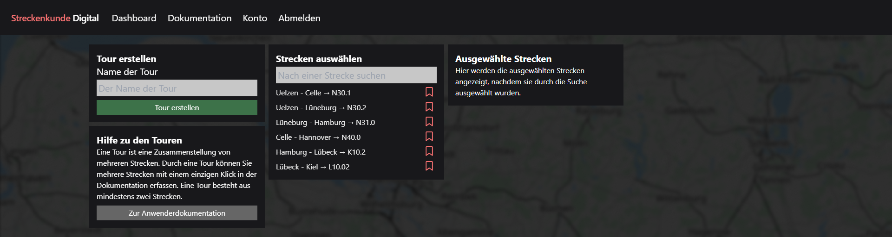
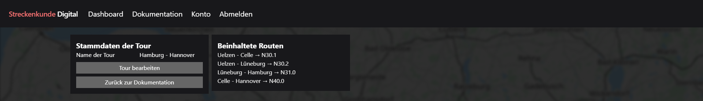
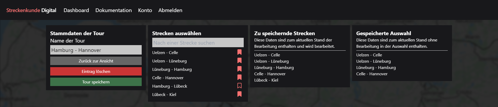

# Touren

Eine Tour ist z.B. eine Fahrt von Hamburg nach Berlin, welche viele [Strecken](../2_tours/index.md) beinhaltet. Somit können auf oft befahrenen Abschnitten oder vorgefertigten Touren die Strecken mit einem einzelnen Klick in der [Dokumentation](../index.md) übernommen werden, statt alle Strecken vereinzelt zu markieren.

## Erstellen

Die Erstellung einer Tour erfolgt über den Button "Tour erstellen" auf der Seite [Dokumentation](../index.md). Die Tour benötigt einen Namen und mindestens zwei Strecken, um erstellt werden zu können. Die Strecken können über die Suchfunktion ausgewählt werden, und wie bei der Dokumentation markiert werden. Alle markierten Strecken sind dann Bestandteil der Tour.

## Ansehen

Um eine Tour anzusehen, klicke auf den Namen einer Tour an einem beliebigen Punkt innerhalb der Anwendung. Es öffnet sich ein Dialog, in dem die Informationen, sowie die beinhalteten Strecken einer Tour eingesehen werden können. Eine Tour kann z.B. über die Suche der [Dokumentation](../index.md) gefunden werden. Über einen Klick auf eine der Strecken in der Tour gelangst du zur Einzelansicht dieser.

## Bearbeiten

Um eine Tour zu bearbeiten, klicke auf den Namen einer Tour an einem beliebigen Punkt innerhalb der Anwendung um die Tour anzusehen. Anschließend klicke auf den Button "Tour bearbeiten". Es öffnet sich ein Dialog, in dem du die notwendigen Informationen, sowie die beinhalteten Strecken ändern oder die Tour gänzlich löschen kannst. 

Wenn die Auswahl der beinhalteten Strecken geändert werden, sind diese erst nach dem Speichern aktiv. Die Anwendung merkt sich dennoch die vorherige Auswahl, z.B. um Strecken zwischenzeitlich zu öffnen oder zu bearbeiten. Kehrt man zur Bearbeitung zurück, sind die Strecken wieder markiert. Die Auswahl der geänderten Strecken ohne Speichern wird verworfen, wenn auf "Zurück zur Ansicht" geklickt wird.

