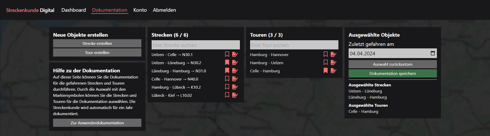
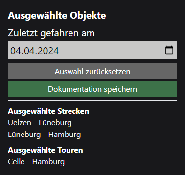

# Dokumentation

Auf dieser Seite hat der Nutzer die Möglichkeit:

1. Seine Streckenkunden zu dokumentieren
2. Strecken anzuzeigen oder zu erstellen
3. Touren anzuzeigen oder zu erstellen

## Strecken

Eine Strecke ist ein Abschnitt im Schienennetz, der von einem Start- zu einem Endpunkt führt. Die Strecke besteht immer aus einem Namen, zwei Punkten (Start und Endpunkt) und optional einem Namen, der Unternehmensintern verwendet wird. Die Strecke kann auch in einer Tour inbegriffen sein, um die Dokumentation mehrerer Strecken zu vereinfachen.

## Touren

Eine Tour enthält mehrere Strecken. Eine Tour kann beispielsweise eine Fahrt von Hamburg nach Berlin sein. In diesem Fall würde die Tour alle Strecken enthalten, die auf dieser Fahrt zurückgelegt werden. Somit können auf oft befahrenen Abschnitten oder vorgefertigten Touren die Strecken mit einem einzelnen Klick in die Dokumentation übernommen werden, statt diese alle vereinzelt zu markieren.

## Dokumentieren

Die Dokumentation einer Streckenkunde erfolgt über die Markierung der gefahrenen Touren oder einzelner Strecken. Die Markierung erfolgt mit dem Lesezeichen-Symbol. Über erneuten Klick kann die Markierung wieder entfernt werden.

Wenn mindestens ein Element markiert wurde, erscheint das Modul zur Dokumentation der Streckenkunde. Hier kann der Nutzer ein Datum festlegen, an dem die Streckenkunde erworben wurde. Standardmäßig ist immer das aktuelle Datum vorausgewählt. Der Ablauf der Streckenkunde wird automatisch berechnet und für ein Jahr festgelegt (364 Tage nach Erwerbsdatum).

