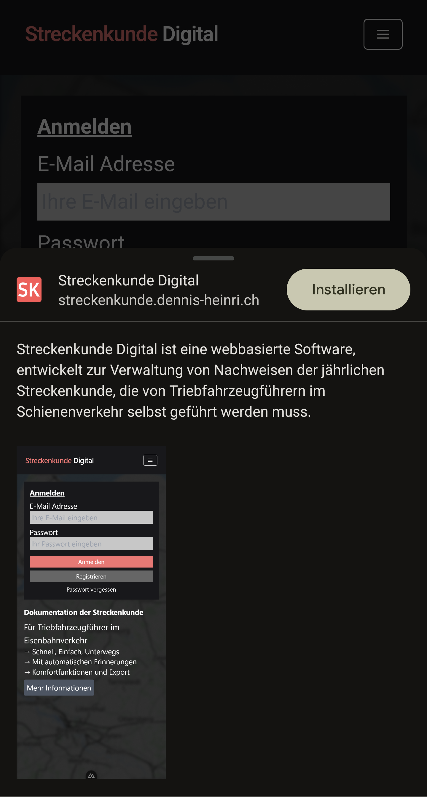

# Installation als App

## Desktop

### Google Chrome

Die Seite kann als App (PWA) auf dem Desktop installiert werden. Dazu wird die Seite im Browser geöffnet und die Option "Installieren" neben der URL-Eingabe ausgewählt.

Es öffnet sich ein Dialog, in dem die Installation bestätigt werden muss.

Anschließend wird die App als Icon und auf dem Desktop abgelegt.

Nach dem Start der App wird die Anwendung in einem eigenen Fenster geöffnet.

## Smartphone

### Android mit Google Chrome

Die Seite kann als App (PWA) auf dem Smartphone installiert werden. Dazu wird die Seite im Browser geöffnet und die Option "App Installieren" in den Einstellungen (Drei-Punkte-Icon) des Chrome-Browsers ausgewählt. Dann wird die Installation bestätigt.

Anschließend wird die App als Icon auf dem Startbildschirm abgelegt und kann dort als App gestartet werden.

Die App ist auch über die App-Übersicht erreichbar, wo sie als eigenständige App angezeigt wird und auch deinstalliert werden kann.

### Apple / iOS

Auf iOS-Geräten kann die App nicht installiert werden, da Apple keine PWAs unterstützt. Die Seite kann jedoch als Startbildschirm-Lesezeichen über Safari hinzugefügt werden, um sie schneller zu öffnen. Dafür wird die Seite im Safari-Browser geöffnet und die Option "Zum Home-Bildschirm" in den Einstellungen (Teilen-Icon) ausgewählt.

Anschließend wird die Installation mit der Vergabe eines Namens bestätigt.

Die Anwendung wird als Icon auf dem Startbildschirm abgelegt und kann dort als Lesezeichen gestartet werden.
